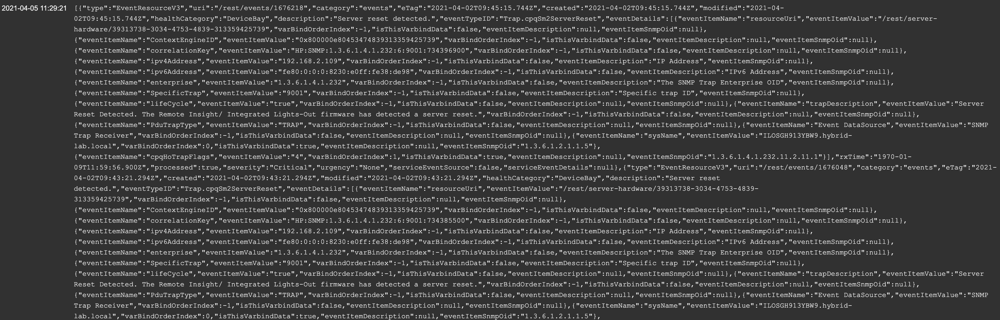
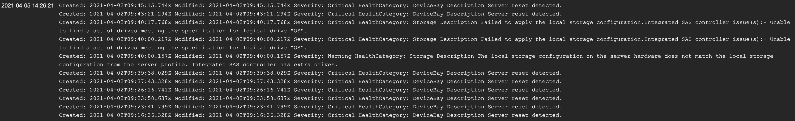

# Zabbix for HPE OneView Sample
This is sample for monitoring HPE OneView on Zabbix. I'm using OneView API to get evnets.

## Setup

### Item Parameters
You have to  create Zabbix item to gather, parse and format OneView events.  
I set some parameters for OneView authentification.

```
[Parameters in Zabbix Item]
ovEndpoint  =>  https://<OneView IP Addr>
ovUser      =>  <OneView User>
ovPassword  =>  <OneView User Password>
ovVersion   =>  <OneView API version>
```

### Set Script
The script sample is [here](getEvents.js).
This script is just gathering events in JSON. So need to parse and re-format in pre-processing.

### Pre-Processing
#### Filter Events
You can get evnets are critical/warning status by usign *JSONPATH* in preprocessing tab.

```
$.members[?(@.severity == "Critical" || @.severity == "Warning")]
```

Now you can see Events as JSON like below.  



#### Re-format Events
JSON is not good for monitoring visually. I'm not sure Zabbix can make JSON LIST separate and insert these in to incident entries.
So I converted JSON into simple text.  
You can use this [sample script](preprocessing_format.js).  


Pls let me know if you know the way that inserts each indexies in JSON list separately into Zabbix incident entries. (I was lazy to read docs actually...)  

Finally I could not be satisfied because some incidents is in ONE entry...  
I made [another solution here](https://github.com/fideltak/oneview-event-logger).